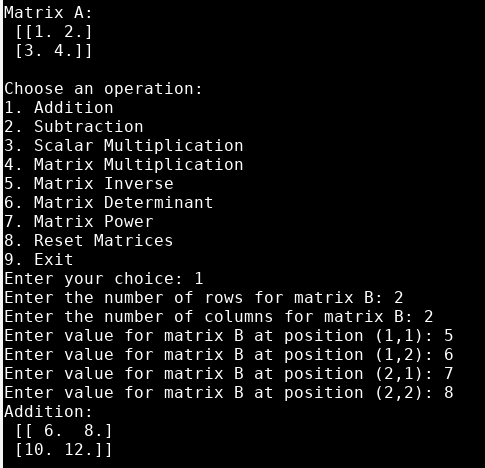
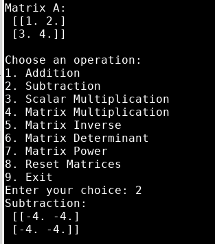
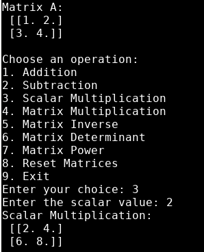
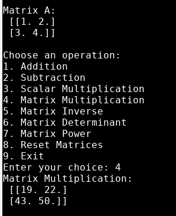
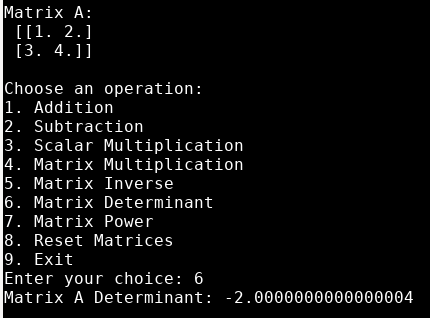
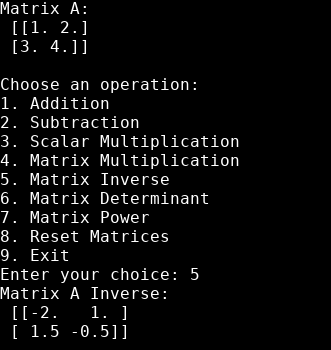
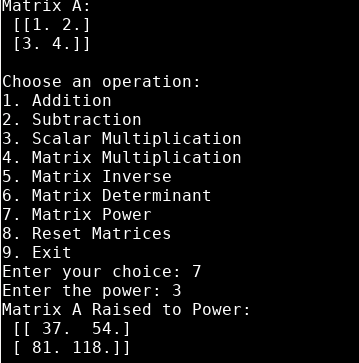

# Exploration Activity 2

## Library
I utilised the **numpy** library in Python    
This is how you implement the library     
**`import numpy`**

## Running the program
My program can be run from the terminal window or command line. 

  1. Open terminal window 
  2. cd into directory that has python file
  3. run **`pip install numpy`** in terminal
  4. run **`python MatrixCalulator.py`** in terminal
  
  
## Purpose
My program runs different calculations on matrices such as addition, subtraction, scalar multiplication, matrix multiplication, inverse, determinant, and power.      
It does these calculations based on matrix calculations defined in linear algebra.

## Sample code output
Addition:      

Subtraction:     

Scalar:     

Multiplication:     

Determinant:     

Inverse:     

Power:    

